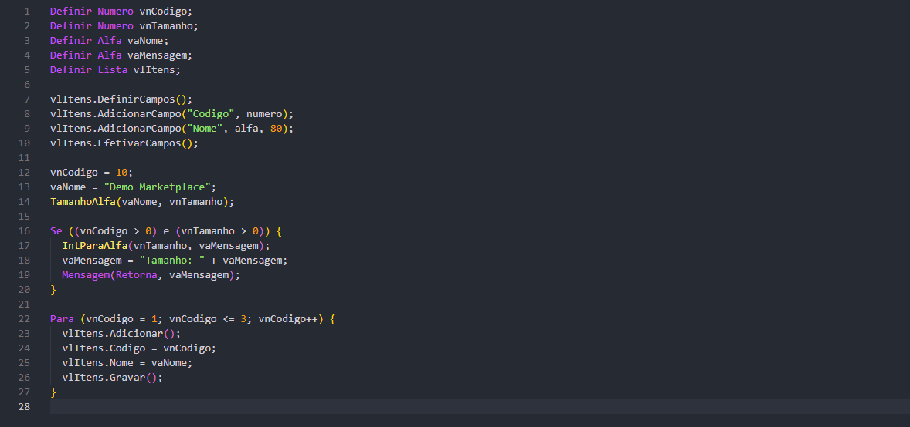
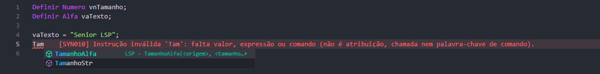
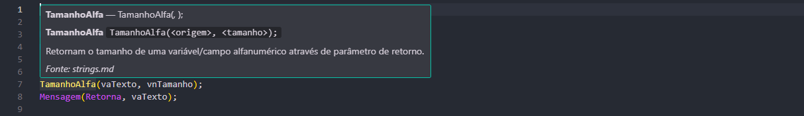
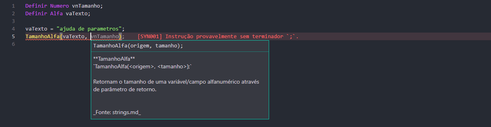
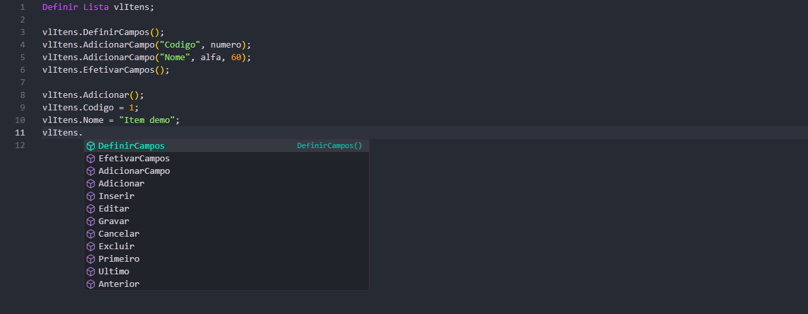
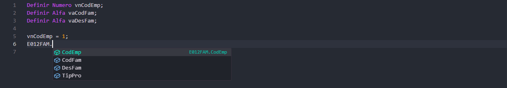
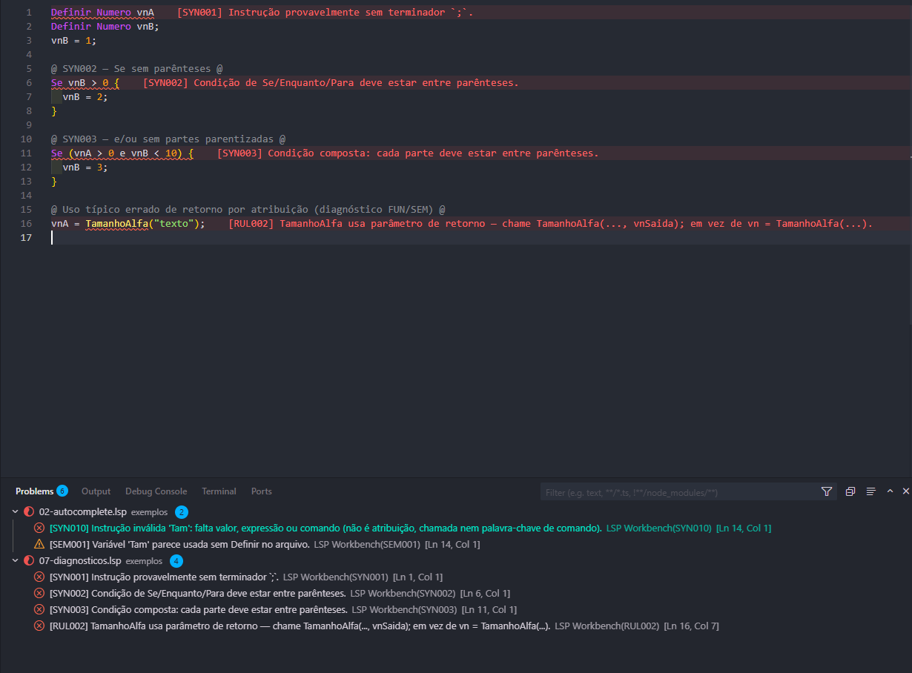
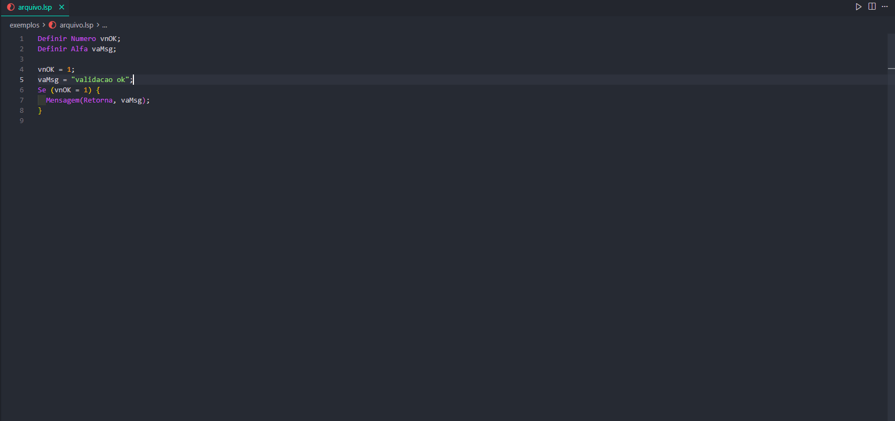

<br />
<p align="center">
  <a href="https://marketplace.visualstudio.com/items?itemName=brunoleocam.lsp-workbench">
    
  </a>

  <h2 align="center">LSP Workbench</h2>

  <p align="center">
    Suporte à <b>Linguagem Senior de Programação (LSP)</b> no Cursor e no Visual Studio Code —
    extensão IDE, Agent e documentação da linguagem para o ecossistema <b>Senior Sistemas</b> (Sapiens, HCM e afins).
  </p>

  <p align="center">
    <a href="https://marketplace.visualstudio.com/items?itemName=brunoleocam.lsp-workbench"></a>
    
    
  </p>
</p>

**Instalar a extensão:** [Marketplace — LSP Workbench](https://marketplace.visualstudio.com/items?itemName=brunoleocam.lsp-workbench) · `ext install brunoleocam.lsp-workbench`

---

## Prévia

<p align="center">
  
</p>

| Highlight | Autocomplete | Hover |
|:---------:|:------------:|:-----:|
|  |  |  |

| Parâmetros | Membros Lista/Cursor | Catálogo de banco |
|:----------:|:--------------------:|:-----------------:|
|  |  |  |

**Diagnósticos** e fluxo de validação + quick fix:

<p align="center">
  <br>
  
</p>

Guia completo do usuário (settings, atalhos, catálogo): [`packages/lsp-workbench/README.md`](packages/lsp-workbench/README.md).

---

## O que é este repositório

Monorepo da plataforma:

| Pacote | Função |
|--------|--------|
| [`packages/lsp-workbench`](packages/lsp-workbench) | Extensão VS Code / Cursor |
| [`packages/lsp-analyzer`](packages/lsp-analyzer) | Analyzer / lint compartilhado |
| [`packages/lsp-language-server`](packages/lsp-language-server) | Language Server (opt-in) |
| [`packages/lsp-workbench-agent`](packages/lsp-workbench-agent) | Agent Cursor (skills / commands) |
| [`docs/lsp`](docs/lsp) | Documentação da linguagem |
| [`docs/gerador-relatorios`](docs/gerador-relatorios) | Modelo mental do Gerador de Relatórios |

Versões atuais: extensão **0.2.1** · analyzer **0.3.x** · LS opt-in. Detalhe de produto: [`docs/product/`](docs/product/).

---

## Extensão IDE (usuário)

Language id: **`senior-lsp`** · arquivos **`.lsp`**, **`.lspt`**

- Coloração, snippets e semantic tokens
- Autocompletar (funções, variáveis, membros de `Cursor` / `Lista`)
- Hover, signature help, Go to Definition, Outline
- Diagnósticos e quick fixes (Ctrl+Espaço / Ctrl+.)
- Formatação e refactors
- Contextos multiarquivo e modo arquivo único
- Catálogo local de tabelas/campos (`lsp.catalog.path`)
- Projeto de relatório (Gerador Senior) com escopo por pasta
- Language Server opt-in (`lsp.server.enabled`, default `false`)

---

## Agent Cursor

| Command | Função |
|---------|--------|
| `/compilar-lsp` | Pré-compilação: regras + sintaxe + semântica (IDs) |
| `/depurar-lsp` | Resumo + ordem de execução + cursores/SQL |
| `/formatar-lsp` | Layout canônico |
| `/refatorar-lsp` | Estrutura, braces, relatório de lógica |
| `/gerar-relatorio` | Scaffold de projeto de relatório |
| `/escopo-relatorio` | Escopo do relatório aberto |
| `/copiar-regra-relatorio` | Juntar regras `.lsp` do relatório |
| `/gerar-lista-lsp` | Lista dinâmica |
| `/gerar-cursor-lsp` | Cursor (+ SQL) |
| `/gerar-http-lsp` | HTTP + parse JSON/XML |

Skills: `@lsp-linguagem` · `@lsp-gerar` · `@lsp-compilar` · `@lsp-depurar` · `@lsp-revisar` · `@lsp-formatar` · `@lsp-refatorar` · `@lsp-logs` · `@lsp-banco` · `@lsp-contexto`

---

## Configurar (desenvolvimento)

```powershell
cd packages\lsp-analyzer
npm install
npm run compile
cd ..\lsp-workbench
npm install
npm test
```

Abra a **raiz do monorepo** → **Run and Debug** → **Run LSP Workbench Extension** (F5).

Setup detalhado: [docs/product/LOCAL-TEST.md](docs/product/LOCAL-TEST.md) · mantenedores: [docs/product/DEVELOPER.md](docs/product/DEVELOPER.md) · publicar: [packages/lsp-workbench/PUBLISH.md](packages/lsp-workbench/PUBLISH.md).

### Associar `.txt` de regra (opcional)

```json
{
  "files.associations": {
    "**/HR/HR*.txt": "senior-lsp",
    "**/TR/TR*.txt": "senior-lsp"
  }
}
```

---

## Usar no workspace

### Arquivo único

Abra um `.lsp` / `.lspt` — ativa `senior-lsp` sem config extra.

### Contextos multiarquivo

```json
{
  "lsp.symbols.scope": "project",
  "lsp.contexts": [
    {
      "name": "HR",
      "rootDir": "HR",
      "filePattern": "HR*.lspt",
      "includeSubdirectories": false,
      "system": "HCM"
    }
  ]
}
```

### Projeto de relatório (Gerador)

Pasta com `relatorio.json` + `Definicao/` ou `Secoes/` — o Ctrl+Espaço fica **só nessa pasta** (não mistura irmãos).

```json
{
  "codigo": "RDCG183",
  "descricao": "Cargas — exemplo",
  "detalhePrincipal": "Detalhe_1",
  "contextoExtra": ["../FUNCOES"]
}
```

| Comando (Palette) | Função |
|-------------------|--------|
| **Gerar Projeto de Relatório** | Scaffold da árvore |
| **Importar Contexto de…** | Pasta/arquivo → `contextoExtra` |
| **Exportar Contexto para…** | Escopo aberto → outro relatório ou `lsp.contexts` |
| **Mostrar Escopo do Relatório** | Root + extras ativos |
| **Copiar Regra** / **Visualizar Todas as Regras** | Clipboard / juntar `.lsp` |

Docs: [`docs/gerador-relatorios/`](docs/gerador-relatorios/).

### Catálogo local de tabelas

A extensão **não** embute dicionário Senior. Gere o seu `catalog.json` a partir do banco (R996/R998):

```powershell
node scripts/catalog-from-r996-tsv.mjs --in r996.tsv --out docs/banco-senior-base/catalog.json
```

Detalhes: [`docs/banco-senior-base/`](docs/banco-senior-base/) · setting `lsp.catalog.path`.

### Formatação / SQL / Language Server

```json
{
  "lsp.format.enabled": true,
  "lsp.format.indentSize": 2,
  "lsp.format.embeddedSql.enabled": false,
  "lsp.server.enabled": false
}
```

---

## Docs

| Recurso | Onde |
|---------|------|
| Guia da extensão (Marketplace) | [`packages/lsp-workbench/README.md`](packages/lsp-workbench/README.md) |
| Exemplos de print / demos | [`packages/lsp-workbench/media/`](packages/lsp-workbench/media/) |
| Exemplos de projeto | [`exemplos/`](exemplos/) |
| Linguagem | [`docs/lsp/`](docs/lsp/) |
| Gerador de Relatórios | [`docs/gerador-relatorios/`](docs/gerador-relatorios/) |
| Produto (PDR/ADR) | [`docs/product/`](docs/product/) |
| Regras estáticas | [`docs/product/regras-estaticas-lsp.md`](docs/product/regras-estaticas-lsp.md) |

---

## Licença e créditos

- Licença: [MIT](LICENSE) — cópia/modificação/redistribuição exigem manter o aviso de copyright e o texto da licença.
- Atribuições a terceiros (incl. referência ao [vscode-language-lsp](https://github.com/llutti/vscode-language-lsp) de Luciano Cargnelutti): [`CREDITS.md`](CREDITS.md).
