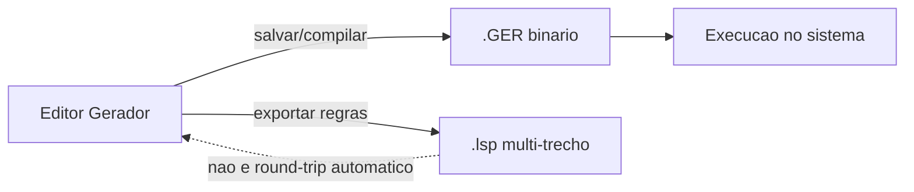

# 02 — Modelo e artefatos

Três “camadas” distintas: o que se edita no Senior, o que o runtime executa, e o que o desenvolvedor exporta para editar regras fora do gerador.

## Comparativo

| Artefato | O que contém | Legível? | Papel |
|----------|--------------|----------|--------|
| **Modelo no editor** | Seções, controles, propriedades, eventos, Entrada, relacionamentos, layout | Sim (UI Senior) | Fonte de verdade do design |
| **`.GER`** | Modelo **compilado** para execução | Quase não (binário) | Deploy / `ExecutaRelatorio("XXX.GER", …)` |
| **Export `.lsp` multi-trecho** | Todas as regras dos eventos, concatenadas com cabeçalhos `Código: N - Descrição: …` | Sim (texto) | Edição/revisão de regras no Workbench / versionamento parcial |



## Formato `.GER` (o que sabemos)

Análise amostral de um `.GER` real (~100 KB+):

- Prefixo binário com **título/descrição** do modelo em texto (ex. nome da tela de entrada).
- Marcadores `BEGINTBSVERSION` / `ENDTBSVERSION` e metadado `VER_CPL` (versão de compilação / TBS).
- Corpo com **alta entropia** (bytes bem distribuídos): não parece um dump textual de LSP.
- **Não** contém, em claro, trechos como `InsClauSQLWhere`, `ModeloGerador_Pré-Seleção`, nomes de tabelas do SELECT das regras, etc.

Conclusão prática para o Workbench:

- **Não tratar `.GER` como fonte editável** nesta fase.
- **Não esperamos descompilação** confiável de layout + propriedades + regras a partir do `.GER`.
- O caminho legível para regras é o **export `.lsp`** (ou a UI do gerador).

## Formato do export `.lsp` (multi-trecho)

Estrutura típica:

```text
--------------------------------------------------------------------------------
Código: 1 - Descrição: ModeloGerador_Funções Globais
--------------------------------------------------------------------------------

<código LSP do evento>

--------------------------------------------------------------------------------
Código: 2 - Descrição: ModeloGerador_Inicialização
--------------------------------------------------------------------------------

...
```

### Taxonomia dos nomes em `Descrição`

| Padrão | Significado |
|--------|-------------|
| `ModeloGerador_<Evento>` | Eventos do modelo: Funções Globais, Inicialização, Pré-Seleção, Seleção, Finalização, Imprimir Página |
| `<Secao>_Antes Imprimir` | Evento Antes de Imprimir da seção |
| `<Secao>_Depois Imprimir` | Evento Depois de Imprimir da seção |
| `<Controle>_Na Impressão` | Evento Na Impressão do controle |

Muitos trechos `_Na Impressão` vêm **vazios** no export (controle sem regra). Isso é normal: o export lista slots de evento, não só código preenchido.

## O que cada artefato **não** contém

| Precisa de… | `.GER` | Export `.lsp` | Editor |
|-------------|--------|---------------|--------|
| Layout / posições / fontes | Sim (binário) | Não | Sim |
| Propriedades de seção (Tabela Base, Classificação…) | Sim (binário) | Não | Sim |
| Definição de Entrada (`E*`) | Sim (binário) | Só se referenciadas no código | Sim |
| Regras LSP | Compiladas | Sim (fonte) | Sim |

## Implicação

Para documentar, revisar ou editar **lógica** de relatório no Workbench, o artefato natural é o **export multi-trecho `.lsp`**. Layout e metadados de modelo continuam no Senior (ou em futura integração, se houver API/formato aberto — hoje não documentado publicamente).

O comando **Importar Relatório** (`lspWorkbench.importarRelatorio` / `/importar-relatorio`) faz o caminho inverso: parse do dump → árvore ADR-007 (`Definicao/` + `Secoes/`). Eventos `*_Na Impressão` ficam listados no README e não geram arquivo.

Próximo: [03-secoes.md](03-secoes.md)
