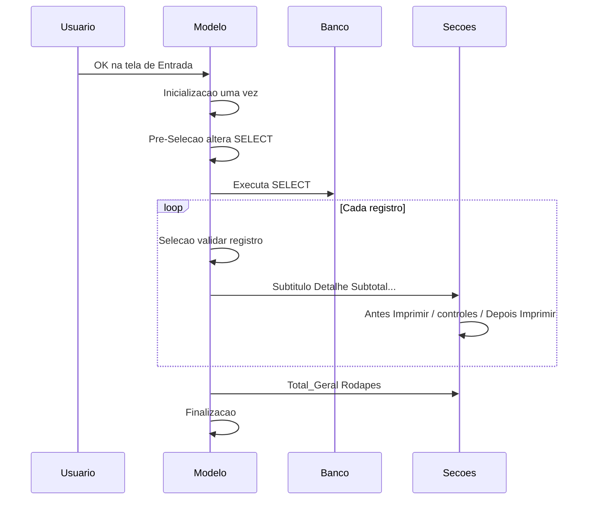

# 04 — Eventos e ciclo de vida

Referência oficial dos eventos do modelo: [Modelo Gerador — Propriedades e Eventos](https://documentacao.senior.com.br/tecnologia/5.10.3/geradores/relatorios/secoes/modelo-gerador.htm).

## Ordem de execução (visão prática)

| Momento | Evento | Quantas vezes | O que fazer |
|---------|--------|---------------|-------------|
| Após OK na Entrada | **Inicialização** | 1 | Declarar/inicializar variáveis; `AlteraControle` de flags; **redeclarar** globals usadas nas Funções Globais |
| Em seguida | **Pré-Seleção** | 1 | **Único** ponto para alterar o SELECT (`InsClauSQL*`, `SubstituiFrom`, `DeleteFieldSQL`, …). Sem listar seções / manipular controles ainda inexistentes |
| Por registro (após SQL) | **Seleção** | 0..N | Validar registro mestre; `Cancel` para excluir linha. Não roda se SQL vazio |
| Por página | **Imprimir Página** | Por página | Ex.: `vBandeja` para bandeja da impressora |
| Por seção | **Antes / Depois de Imprimir** | Por impressão da seção | Cálculos, fórmulas, zebrado, `ListaSecao` |
| Por controle | **Na Impressão** | Por impressão do controle | Valor dinâmico, `Cancel` no campo, `ValStr` |
| Fim | **Finalização** | 1 | Liberar estruturas / fechar transações |
| Sob demanda | **Funções Globais** | Nunca “executa” o bloco | Só declara funções; chamadas a partir de outros eventos |

## Funções Globais — armadilha

- O evento **não inicializa** variáveis em runtime.
- Variáveis globais usadas pelas funções devem ser **redeclaradas/inicializadas na Inicialização**.
- Em relatórios, funções e variáveis tendem a ser **globais** entre regras do mesmo modelo (incluindo parâmetros de função visíveis em outras regras — comportamento do ambiente de relatórios).

## Nomes no export `.lsp`

| Export | Evento UI |
|--------|-----------|
| `ModeloGerador_Funções Globais` | Funções Globais |
| `ModeloGerador_Inicialização` | Inicialização |
| `ModeloGerador_Pré-Seleção` | Pré-Seleção |
| `ModeloGerador_Seleção` | Seleção |
| `ModeloGerador_Finalização` | Finalização |
| `ModeloGerador_Imprimir Página` | Imprimir Página |
| `Detalhe_X_Antes Imprimir` | Detalhe X → Antes de Imprimir |
| `Cadastro001_Na Impressão` | Controle Cadastro001 → Na Impressão |

## `Cancel` no Gerador de Relatórios

Detalhe normativo também em [`docs/lsp/cancel.md`](../lsp/cancel.md). Síntese por contexto (curso / docs Senior):

| Contexto | `Cancel(1)` | `Cancel(2)` | `Cancel(3)` |
|----------|-------------|-------------|------------|
| **Na Impressão** (controle) | Cancela impressão do campo; considera nos totais | Cancela campo/lista e imprime `ValStr`; considera nos totais | Cancela impressão do campo; **não** considera nos totais |
| **Antes de Imprimir** (seção) | Cancela seção; considera totais | Cancela seção; considera totais | Cancela seção/registro no detalhe; **não** considera totais |
| **Seleção** | Cancela registro | Cancela registro | Cancela registro |
| **Pré-Seleção** | Aborta relatório | Aborta relatório | Aborta relatório |

Em regras de tela fora do gerador, `Cancel(n)` tipicamente só interrompe a regra (sem a semântica de relatório).

## Imprimir Página e `vBandeja`

Após a regra, o gerador lê a variável numérica **`vBandeja`** (se existir) para escolher a bandeja. Valores comuns 1–15 (tabela MSDN / docs Senior); valores > 100 podem ser códigos específicos da impressora.

## Onde colocar lógica (performance)

Preferência usual do curso:

- Tratamentos que rodam **uma vez** → Inicialização / Pré-Seleção.
- Filtro de registro → Seleção ou `Cancel` no Antes de Imprimir da Detalhe.
- Cálculo por linha → Antes de Imprimir da Detalhe (não no Depois, se o valor ainda precisa ser impresso na mesma passagem).
- Blocos opcionais → Adicional + `ListaSecao`.

Próximo: [05-controles.md](05-controles.md)
