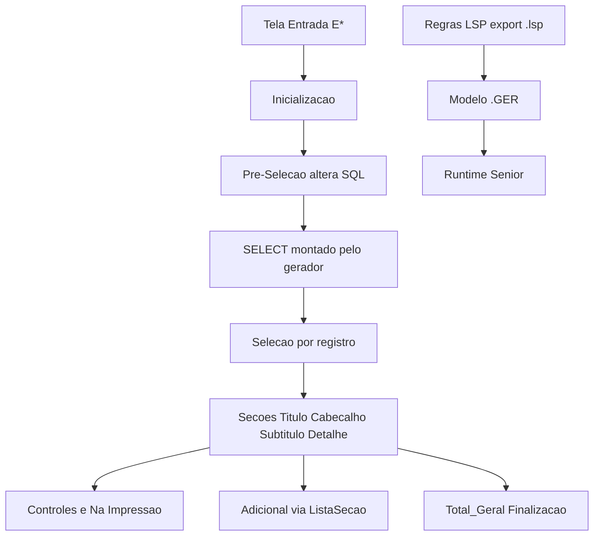

# Gerador de Relatórios Senior — modelo mental

Base de conhecimento para o **LSP Workbench**: como o Gerador de Relatórios monta modelos, seções, eventos, entrada, SQL e artefatos (`.GER` / export `.lsp`).

**Escopo desta pasta:** arquitetura e ciclo de vida do gerador.  
**Não é:** catálogo completo de funções (já está em [`docs/lsp/funcoes-especificas-do-gerador-de-relatorios.md`](../lsp/funcoes-especificas-do-gerador-de-relatorios.md)) nem PDR de produto (ver [10-implicacoes-workbench.md](10-implicacoes-workbench.md)).

## Ordem de leitura

| # | Arquivo | Conteúdo |
|---|---------|----------|
| 1 | [01-visao-geral.md](01-visao-geral.md) | O que é o gerador, tipos, categoria/número, limites |
| 2 | [02-modelo-e-artefatos.md](02-modelo-e-artefatos.md) | Editor vs `.GER` vs export `.lsp` |
| 3 | [03-secoes.md](03-secoes.md) | Catálogo de seções e propriedades-chave |
| 4 | [04-eventos-ciclo-vida.md](04-eventos-ciclo-vida.md) | Ordem dos eventos e `Cancel` |
| 5 | [05-controles.md](05-controles.md) | Controles e `_Na Impressão` |
| 6 | [06-entrada.md](06-entrada.md) | Variáveis `E*` e tela de entrada |
| 7 | [07-sql-e-joins.md](07-sql-e-joins.md) | Tabela Base, joins, `InsClauSQL*` |
| 8 | [08-funcoes-especificas.md](08-funcoes-especificas.md) | Famílias de APIs + ponte ao catálogo LSP |
| 9 | [09-estudo-caso-rdcg183.md](09-estudo-caso-rdcg183.md) | Mapa de eventos de um export real |
| 10 | [10-implicacoes-workbench.md](10-implicacoes-workbench.md) | Implicações → [PDR-008](../product/pdr/PDR-008-projeto-relatorio.md) / [ADR-007](../product/adr/ADR-007-formato-projeto-relatorio.md) |
| 11 | [11-siglas-senior.md](11-siglas-senior.md) | Árvore de siglas (categoria = módulo + assunto) |
| — | [schema/](schema/) | JSON Schema do projeto multi-arquivo |

## Mapa mental (runtime)

## Fontes

- Portal Senior Tecnologia 5.10.3 / 6.10.3 (Gerador de Relatórios e funções LSP) — versões com descontinuação anunciada; conteúdo ainda útil como referência.
- Anotações de curso / exports `.GER` de cliente — **não** versionar na raiz do repo público.
- Export de regras de exemplo local (`*.lsp` multi-trecho) — não commitado como fixture de cliente.

## Relação com o monorepo

| Pasta | Papel |
|-------|--------|
| `docs/gerador-relatorios/` | Modelo mental do gerador |
| `docs/lsp/` | Sintaxe LSP + catálogo de funções (incl. gerador) |
| `docs/product/` | PDR/ADR do Workbench |

Documentação oficial (entrada): [Gerador de Relatórios](https://documentacao.senior.com.br/tecnologia/5.10.3/geradores/relatorios/definit.htm) · [Funções específicas](https://documentacao.senior.com.br/tecnologia/5.10.3/lsp/funcoes/gerador-de-relatorios.htm)
