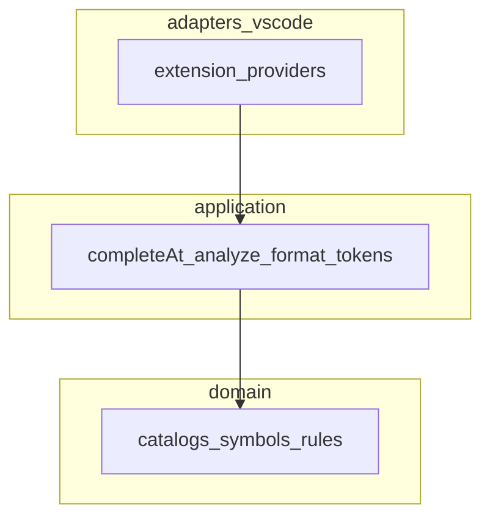
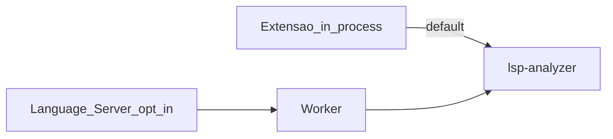

# Arquitetura — LSP Workbench

## Visão

Monorepo com três artefatos (ADR-001):

| Artefato | Package | Visibilidade |
|----------|---------|--------------|
| Extensão IDE | `packages/lsp-workbench` | público |
| Agent Cursor | `packages/lsp-workbench-agent` | público |
| Plugin Demóbile | `packages/lsp-workbench-demobile` | gitignored |

Núcleos de linguagem (públicos):

| Package | Papel | Versão |
|---------|-------|--------|
| `packages/lsp-analyzer` | Lexer/parser/AST/semantic (`ANL*`) | 0.2.0 |
| `packages/lsp-language-server` | LS + Worker (opt-in) | 0.1.0 |

Roadmap: **UX → analyzer → LS** — [ADR-006](../adr/ADR-006-roadmap-opcoes-1-2-3.md). Próximo: Agent (PDR-006) e bridge Demóbile (PDR-007).

## Clean Architecture (extensão)

| Camada | Pode depender de | Não pode |
|--------|------------------|----------|
| domain | nada externo de editor | `vscode`, fs de workspace |
| application | domain | `vscode` |
| adapters/vscode | application, domain, `vscode` | regras de negócio novas inline |

Detalhe: [ADR-005](../adr/ADR-005-clean-architecture-nucleo-puro.md).

## Fluxo de análise (hoje)

- Default: extensão chama `analyze()` in-process e faz merge com diagnostics heurísticos (SYN/RUL/…).
- Opt-in: `lsp.server.enabled` → LS + Worker → mesmos diagnostics ANL* (`source: LSP Analyzer`).
- Format/completion/outline/refactors permanecem na extensão nesta foundation.

## Princípios de código

- SOLID e Clean Code em todo PR.
- README + CHANGELOG atualizados ao fechar leva.
- Implementação própria; IDs canônicos SYN/RUL/FUN/SEM/SQL + ANL*.
- Demóbile privado nunca no remoto público.

## Mapa de docs

| Doc | Uso |
|-----|-----|
| [PDR-003](../pdr/PDR-003-simbolos-contexto-completion.md) | Símbolos / contextos |
| [PDR-004](../pdr/PDR-004-paridade-ux.md) | UX IDE (concluído) |
| [PDR-005](../pdr/PDR-005-compiler-e-language-server.md) | Analyzer + LS |
| [PDR-006](../pdr/PDR-006-agent-analyzer.md) | Agent ↔ analyzer |
| [PDR-007](../pdr/PDR-007-demobile-catalog-bridge.md) | Demóbile → catálogos IDE |
| [TDD-paridade-ux](../tdd/TDD-paridade-ux.md) | Casos ACC-* |
| [EVAL-paridade-ux](../eval/EVAL-paridade-ux.md) | Checklist |
