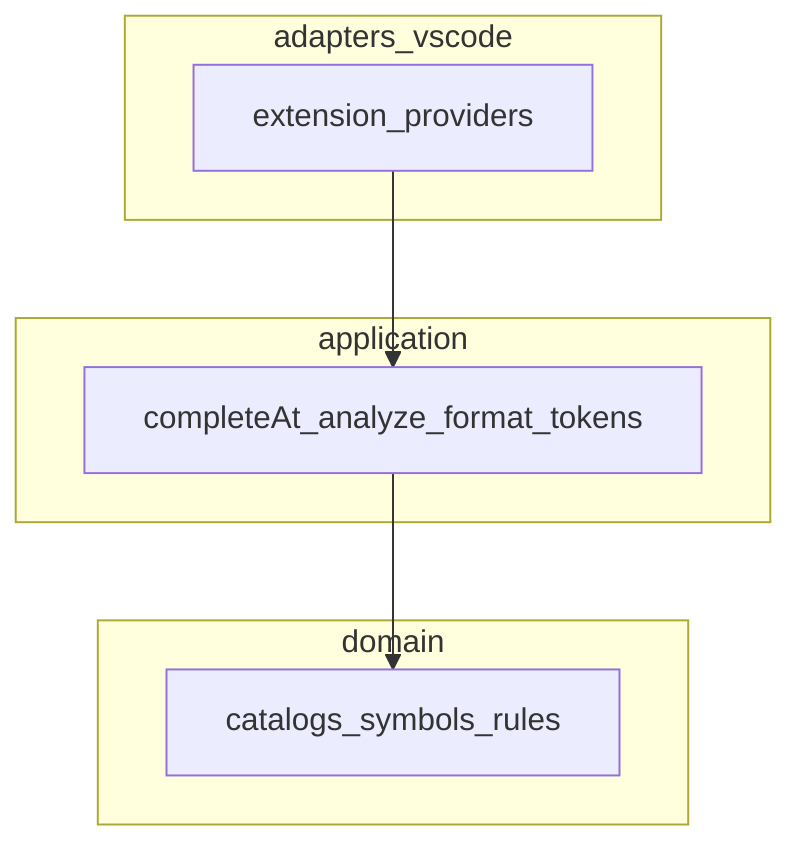
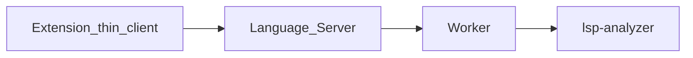

# Arquitetura — LSP Workbench

## Visão

Monorepo com três artefatos (ADR-001):

| Artefato | Package | Visibilidade |
|----------|---------|--------------|
| Extensão IDE | `packages/lsp-workbench` | público |
| Agent Cursor | `packages/lsp-workbench-agent` | público |
| Plugin Demóbile | `packages/lsp-workbench-demobile` | gitignored |

Roadmap de análise de linguagem: **Opção 1 (UX) → Opção 2 (analyzer) → Opção 3 (LS/Worker)** — [ADR-006](../adr/ADR-006-roadmap-opcoes-1-2-3.md).

## Clean Architecture (extensão)

| Camada | Pode depender de | Não pode |
|--------|------------------|----------|
| domain | nada externo de editor | `vscode`, fs de workspace |
| application | domain | `vscode` |
| adapters/vscode | application, domain, `vscode` | regras de negócio novas inline |

Detalhe: [ADR-005](../adr/ADR-005-clean-architecture-nucleo-puro.md).

## Opção 2 / 3 (futuro)

## Princípios de código

- SOLID e Clean Code em todo PR.
- README + CHANGELOG atualizados ao fechar leva.
- Sem copiar código de extensões terceiras (PDR-004).
- Demóbile privado nunca no remoto público.

## Mapa de docs

| Doc | Uso |
|-----|-----|
| [PDR-004](../pdr/PDR-004-paridade-ux.md) | Opção 1 |
| [PDR-005](../pdr/PDR-005-compiler-e-language-server.md) | Opções 2–3 |
| [TDD-paridade-ux](../tdd/TDD-paridade-ux.md) | Casos ACC-* |
| [EVAL-paridade-ux](../eval/EVAL-paridade-ux.md) | Checklist |
